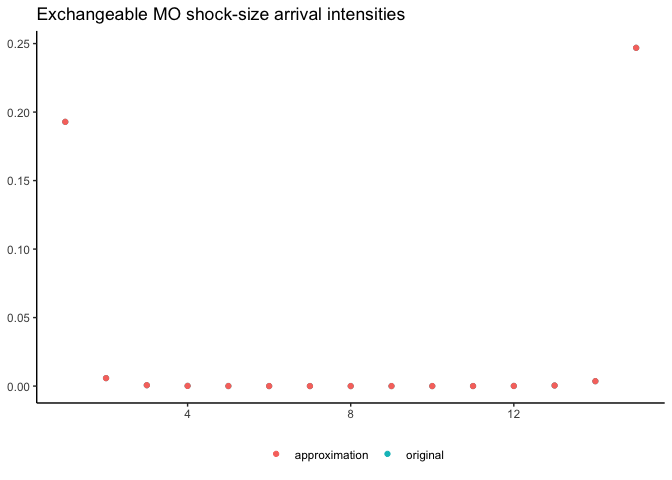

<!-- README.md is generated from README.Rmd. Please edit that file -->

# rmo

<!-- badges: start -->


[](https://www.repostatus.org/#wip)
[](https://www.tidyverse.org/lifecycle/#experimental)
[](/commits/master)
[](https://github.com/hsloot/rmo/actions)
[](https://codecov.io/gh/hsloot/rmo?branch=main)
<!-- badges: end -->

An R package for constructing and simulating *Marshall-Olkin
distribution*.

## Motivation

While the academic literature about Marshall-Olkin distributions is
extensive, an intuitive and easy-to-use implementation is still missing.
This project aims to provide an `R` package makes it simple and fun to
use Marshall-Olkin distributions for research and real-world
applications.

## Installation

You can install the development version from
[GitHub](https://github.com/) with:

``` r
# install.packages("devtools")
devtools::install_github("hsloot/rmo")
```

## Usage

We provide drop-in wrapper `rpextmo`for simulating several parametric
families of exchangeable Marshall-Olkin distributions: For example to
simulate from the family associated with the $\alpha$-stable
distribution, use

``` r
rpextmo(
    n = 10, d = 3,
    eta = log2(2 - 0.5),
    family = "AlphaStable"
)
#>             [,1]      [,2]       [,3]
#>  [1,] 1.43771730 1.4377173 1.43771730
#>  [2,] 2.05209628 1.3530518 1.91148856
#>  [3,] 0.57433836 1.3811189 1.90247610
#>  [4,] 0.75080505 1.1922738 0.54154504
#>  [5,] 1.71072303 1.7107230 0.25935362
#>  [6,] 0.50637200 0.5063720 0.50637200
#>  [7,] 1.70689790 1.7068979 0.43169613
#>  [8,] 0.07250493 0.7784406 0.07250493
#>  [9,] 1.83458658 1.3509871 1.83458658
#> [10,] 2.57508782 0.1130284 0.91314202
```

All parametric families are based on so-called Bernstein functions. For
the previous example, the associated Bernstein function can be defined
via:

``` r
alpha <- log2(2 - 0.5)
bf <- AlphaStableBernsteinFunction(
    alpha = alpha
)
bf
#> An object of class "AlphaStableBernsteinFunction"
#> - alpha: 0.5849625
```

Bernstein functions are closed under addition, scaling, and composite
scaling, which can be used to create new Bernstein functions. The
following Bernstein function approximates the Bernstein function
associated with the $\alpha$-stable distribution from the previous
example.

``` r
x0 <- 5e-4
bf_approximated <- SumOfBernsteinFunctions(
    first = LinearBernsteinFunction(
        scale = alpha * x0^(1 - alpha) / (1 - alpha) / gamma(1 - alpha)
    ),
    second = ScaledBernsteinFunction(
        scale = x0^(-alpha) / gamma(1 - alpha),
        original = ParetoBernsteinFunction(
            alpha = alpha,
            x0 = x0
        )
    )
)
```

Bernstein functions are closed under addition, scaling, and composite
scaling, which can be used to create new Bernstein functions:



## Word of caution for high dimensions

The package, including the simulation algorithms, is extensively tested
with unit tests. Nevertheless, it can happen to run into unexpected
results for certain parametrizations in high dimensions. The reason for
this are numerical issues with very small and very large numbers. We
tried to program defensively to avoid these problems, but if the
dimension is high enough and the parametrization leads to values below
the double precision, at some point numerical issues are inevitable. For
this reason, we encourage users to produce statistical tests suitable
for their use-case; see our [integration
test](https://github.com/hsloot/rmo/blob/master/other/integration-test.Rmd)
for an example. If you are encountering statistical problems, please
submit an [issue
report](https://github.com/hsloot/rmo/issues/new?assignees=&labels=bug&template=statistical_problem.md&title=%5BSTAT%5D)
including a [reprex](https://github.com/tidyverse/reprex).

## Roadmap for future development

The aim of this package is the seamless and efficient simulation of
Marshall-Olkin distributions. For this, we provide the primary function
of this package: `rpextmo`. You may

- *assume stability of its interface* ✅, but

- *do not assume stability of its simulation results* ❌.

We are planning to develop the package incrementally. The API of other
functions might change. Ideas for future changes are:

- Refactoring the `arnold_distribution` and the
  `markovian_exmo_distribution` to be based on a
  `random_walk_distribution` and `markov_process`.

- Add a distribution to sample from the Arnold model with exchangeable
  shock-size arrival intensities which does not require to store all
  shock arrival intensities.

- Implement the calculation of *exchangeable shock-size arrival
  intensities* and the corresponding Markov generator in C++. Consider
  using the [C++ wrapper to R’s C-API for
  integration](https://github.com/hsloot/integratecpp), and implementing
  a C++ backend for Bernstein functions.

Other ideas for the future:

- Implementation of estimation routines (**help wanted**).

- Representation and simulation of hierarchical Marshall-Olkin
  distributions.

## Contributing

Contribution is highly appreciated. Contribution can range from
improving the documentation, writing tests, or raising issues and
feature requests to implementing feature requests or fixing bugs. If you
consider to contribute, have a look at our [contribution
guide](.github/CONTRIBUTING.md).

## License

GPL-3 Henrik Sloot
