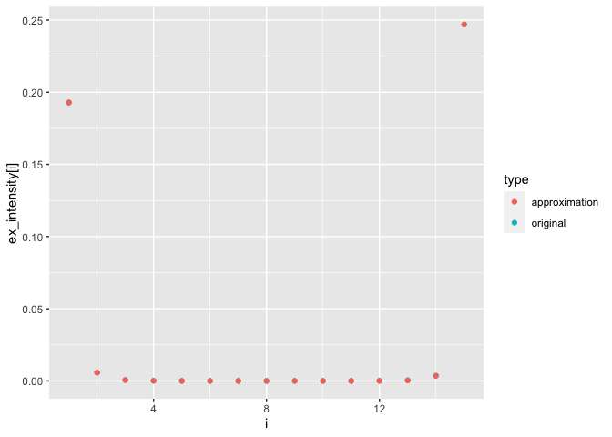

<!-- README.md is generated from README.Rmd. Please edit that file -->

# rmo

<!-- badges: start -->


[](https://www.repostatus.org/#wip)
[](https://www.tidyverse.org/lifecycle/#experimental)
[](/commits/master)
[](https://github.com/hsloot/rmo/actions)
[](https://codecov.io/gh/hsloot/rmo?branch=master)
<!-- badges: end -->

An R package for the *Marshall-Olkin distribution*: algorithms for the
construction, simulation and estimation.

## Motivation

While the academic literature on the Marshall-Olkin distributions is
extensive, an intuitive and easy to use implementation is still missing.
This project aims to provide an `R` package makes it simple and fun to
use Marshall-Olkin distributions for research and real-world
applications.

## Installation

You can install the development version from
[GitHub](https://github.com/) with:

``` r
# install.packages("devtools")
devtools::install_github("hsloot/rmo")
```

## Example

``` r
rexmo_markovian(
  n=10L, d=2L,
  ex_intensities_alpha_stable(d=2L, alpha=log2(2 - 0.5)))
#>             [,1]       [,2]
#>  [1,] 1.82255349 2.04294988
#>  [2,] 0.82987456 1.53257997
#>  [3,] 1.09917209 1.02782419
#>  [4,] 0.86267662 1.04833969
#>  [5,] 0.63310836 0.33621260
#>  [6,] 3.07610878 1.63578070
#>  [7,] 1.45136942 1.45136942
#>  [8,] 0.02648939 0.02648939
#>  [9,] 0.02369604 0.02369604
#> [10,] 1.11184824 1.91441857
```

### Approximate an Alpha-Stable BF

``` r
alpha <- log2(2 - 0.5)
bf <- AlphaStableBernsteinFunction(alpha=alpha)

x0 <- 5e-4
bf_approx <- SumOfBernsteinFunctions(
  first=LinearBernsteinFunction(
    scale = alpha*x0^(1-alpha)/(1-alpha)/gamma(1-alpha)
  ),
  second=ScaledBernsteinFunction(
    scale = x0^(-alpha)/gamma(1-alpha),
    original = ParetoBernsteinFunction(alpha=alpha, x0=x0)
  )
)
```



## Word of caution for high dimensions

The package, including the simulation algorithms, is extensively tested
with unit tests. Nevertheless, it can happen to run into unexpected
results for certain parameterisations in high dimensions. The reason for
this are numerical issues with very small and very large numbers. We
tried to program defensively to avoid these problems, but if the
dimension is high enough and the parameterisation leads to values below
the double precision, at some point numerical issues are inevitable. For
this reason, we encourage users to produce statistical tests suitable
for their use-case. An example can be found in
<https://github.com/hsloot/rmo/blob/master/other/integration-test.Rmd>.
If you are encountering statistical problems, please submit an [issue
report](https://github.com/hsloot/rmo/issues/new?assignees=&labels=bug&template=statistical_problem.md&title=%5BSTAT%5D)
including a [reprex](https://github.com/tidyverse/reprex).

## Roadmap for future development

We are planning to develop the package incrementally. The packages API
might change frequently without deprecation. As of now, we have
completed the reimplementation of all sampling algorithms in `Rcpp`. Our
next steps are:

-   **Version 0.7**: Refactor the `arnold_distribution` and the
    `markovian_exmo_distribution` to be based on a
    `random_walk_distribution` and `markov_process`. Add a distribution
    to sample from the Arnold model with `ex_intensities` which does not
    require to store all shock intensities.

Other ideas for the future:

-   Implementation of estimation routines (**help wanted**).
-   An *OOP* implementation of the Marshall–Olkin distribution with the
    ultimate goal to facilitate a hierarchical construction of
    Marshall–Olkin distributions.

## Contributing

Contribution is highly appreciated. Contribution can range from
improving the documentation, writing tests, or raising issues and
feature requests to implementing feature requests or fixing bugs. If you
consider to contribute, have a look at our [contribution
guide](.github/CONTRIBUTING.md).

## License

GPL-3 Henrik Sloot
