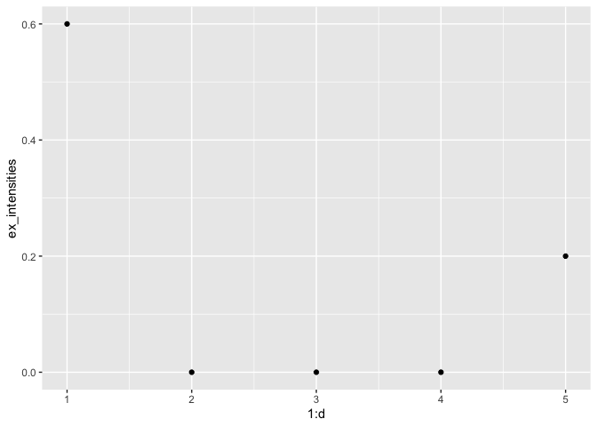
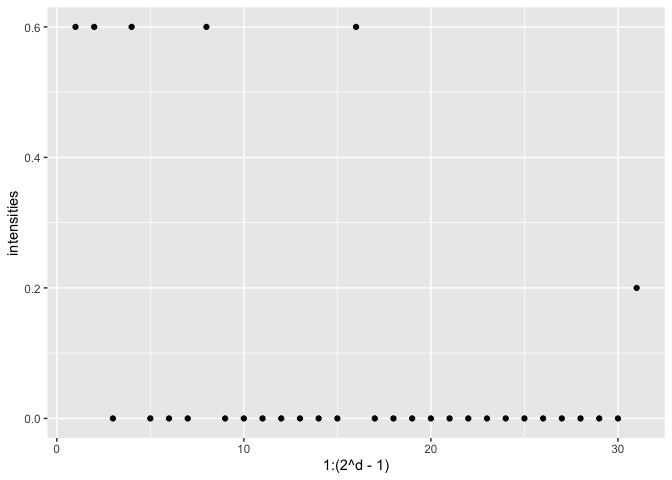
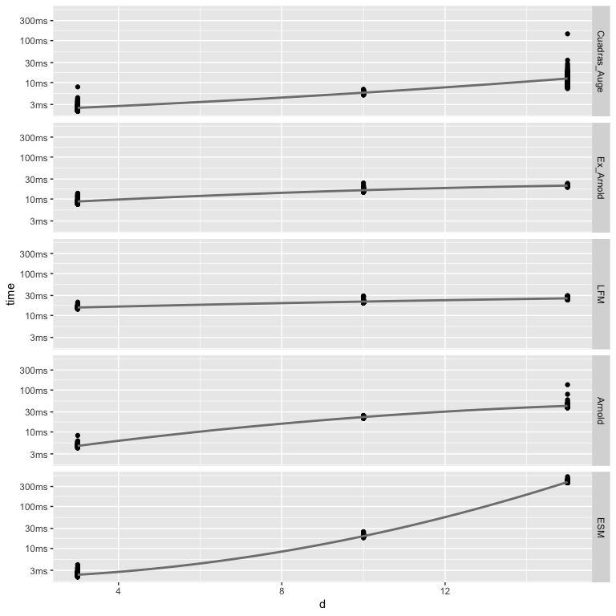

An introduction to `rmo`
================

## Summary

In this notebook, we will benchmark the runtime of the various sampling
algorithms which are implemented in this package.

## Setup

Appart from this package, we require the following packages:

  - `bench` (for benchmarks),
  - `magrittr`, `dplyr`, `tidyr` (data manipulation), and
  - `ggplot2`, `ggbeeswarm`, `scales` (plotting).

<!-- end list -->

``` r
library("rmo")

library("bench")

library("magrittr")
library("purrr")
library("dplyr")
library("tidyr")

library("ggplot2")
library("ggbeeswarm")
library("scales")
```

## Cuadras-Augé parametrisation

The Cuadras-Augé parametrisation corresponds to an exchangeable
exogenous shock model with individual shocks with rate \(\alpha\) and a
global shock with rate \(\beta\).

The Bernstein function is \[
  \psi(x)
    = \beta  + x \alpha ,
    \quad x > 0 .
\]

### Create a Bernstein function instance

We can create an instance of the corresponding Bernstein function using
the package

``` r
alpha <- 0.6
beta <- 0.2
bf_const <- ConstantBernsteinFunction(constant=beta)
bf_lin <- LinearBernsteinFunction(scale=alpha)
bf <- SumOfBernsteinFunctions(first=bf_const, second=bf_lin)
bf
#> An object of class "SumOfBernsteinFunctions"
#> Slot "first":
#> An object of class "ConstantBernsteinFunction"
#> Slot "constant":
#> [1] 0.2
#> 
#> 
#> Slot "second":
#> An object of class "LinearBernsteinFunction"
#> Slot "scale":
#> [1] 0.6
```

### Calculate the ex-intensity parameters

The rate parameters for the exchangeable Marshall–Olkin model can be
calculated with the following formula \[
  \lambda_i
    = {(-1)}^{i-1} \Delta^{i} \psi{(d-i)},
    \quad i \in {\{ 1 , \ldots , d \}} .
\]

This can be done manually as follows

``` r
d <- 5
psi_values <- map_dbl(0:d, ~{
  valueOf(bf, .x, 0L)
})
ex_intensities <- map_dbl(1:d, ~{
  (-1)^(.x-1) * diff(psi_values[1+(d-.x):d], differences=.x)
})
```

> **Disclaimer**: The approach above is not recommended to be used in
> practice and only included to demonstrate how to use the Bernstein
> function classes.

Manually calculating iterated differences is numerically unstable and
ultimately can lead to negative intensities. For this reason, these
differences are internally calculated with a different representation.
This can be used as follows

``` r
d <- 5
ex_intensities <- map_dbl(1:d, ~{
  ## (-1)^{.x-1} \Delta^{.x} \psi(d-.x)
  valueOf(bf, d-.x, difference_order=.x)
})
```

### Drop-in wrappers to create ex-intensity parameters

For some specific Bernstein functions, we provide convenience wrappers
to do this in a more concise way. Here we could do

``` r
d <- 5
ex_intensities <- ex_intensities_cuadras_auge(d, alpha, beta)
qplot(1:d, ex_intensities)
```

<!-- -->

There is more:

  - Poisson subordinator BF
  - Gamma subordinator BF
  - Alpha Stable subordinator BF

### Create intensities parameter

``` r
d <- 5
intensities <- intensities_cuadras_auge(d, alpha, beta)
qplot(1:(2^d-1), intensities)
```

<!-- -->

### Benchmark

  - We have the Cuadras-Augé parametrisation \(\alpha, \beta \geq 0\)
    with \(\alpha + \beta > 0\).
  - We can calculate the representations
    \(\lambda_i, i \in {\{ 1, \ldots, d \}}\) and
    \(\lambda_I, \emptyset \neq I \subseteq {\{ 1 , \ldots , d \}}\) as
    above from \(\psi\).
  - This parametrisation corresponds to a LFM with drift \(\alpha\) and
    killing rate \(\beta\).

<!-- end list -->

``` r
n <- 1e4
d <- c(3L, 10L)
alpha <- c(0.1, 0.4, 0.8)
beta <- c(0.1, 0.4, 0.8)

bp1 <- bench::press(
  "d" = d,
  "alpha" = alpha,
  "beta" = beta,
  {
    ex_intensities <- ex_intensities_cuadras_auge(d, alpha, beta)
    intensities <- intensities_cuadras_auge(d, alpha, beta)
    force(ex_intensities)
    force(intensities)
    bench::mark(
      Cuadras_Auge = rmo:::Rcpp__rmo_esm_cuadras_auge(n, d, alpha, beta),
      Ex_Arnold = rmo:::Rcpp__rmo_ex_arnold(n, d, ex_intensities),
      LFM = rmo:::Rcpp__rmo_lfm_cpp(
        n, d, 0, beta, alpha, "rposval", list("value" = 1)),
      Arnold = rmo:::Rcpp__rmo_arnold(n, d, intensities),
      ESM = rmo:::Rcpp__rmo_esm( n, d, intensities),
      min_iterations = 100L,
      check=FALSE
    )
  }
)

bp1 %>%
  unnest(cols = c("time", "gc")) %>%
  mutate(expression = factor(
    expression,
    levels = c("Cuadras_Auge", "Ex_Arnold", "LFM", "Arnold", "ESM")
    )) %>%
  ggplot(aes(expression, time, colour = gc)) +
  ggbeeswarm::geom_quasirandom() +
  ggplot2::coord_flip() +
  theme(legend.position = "bottom") +
  facet_grid(d + alpha ~ beta)
```

<!-- -->

``` r
n <- 1e4
d <- c(3L, 10L, 15L)
alpha <- 0.8
beta <- 0.4

bp2 <- bench::press(
  "d" = d,
  {
    ex_intensities <- ex_intensities_cuadras_auge(d, alpha, beta)
    intensities <- intensities_cuadras_auge(d, alpha, beta)
    force(ex_intensities)
    force(intensities)
    bench::mark(
      Cuadras_Auge = rmo:::Rcpp__rmo_esm_cuadras_auge(n, d, alpha, beta),
      Ex_Arnold = rmo:::Rcpp__rmo_ex_arnold(n, d, ex_intensities),
      LFM = rmo:::Rcpp__rmo_lfm_cpp(
        n, d, 0, beta, alpha, "rposval", list("value" = 1)),
      Arnold = rmo:::Rcpp__rmo_arnold(n, d, intensities),
      ESM = rmo:::Rcpp__rmo_esm(n, d, intensities),
      min_iterations = 100L,
      check=FALSE
    )
  }
)

bp2 %>%
  unnest(cols = c("time", "gc")) %>%
  mutate(expression = factor(
    expression,
    levels = c("Cuadras_Auge", "Ex_Arnold", "LFM", "Arnold", "ESM")
    )) %>%
  filter(gc == "none") %>%
  ggplot(aes(x=d, y=time)) +
  geom_point() +
  geom_smooth(method = "lm", se = FALSE, colour = "grey50", formula = y ~ x + I(x^2)) +
  theme(legend.position = "bottom") +
  facet_grid(expression ~ .)
```

<!-- -->
