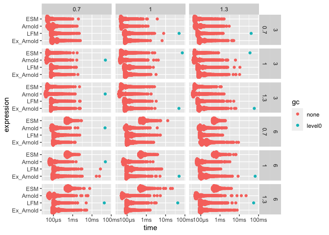
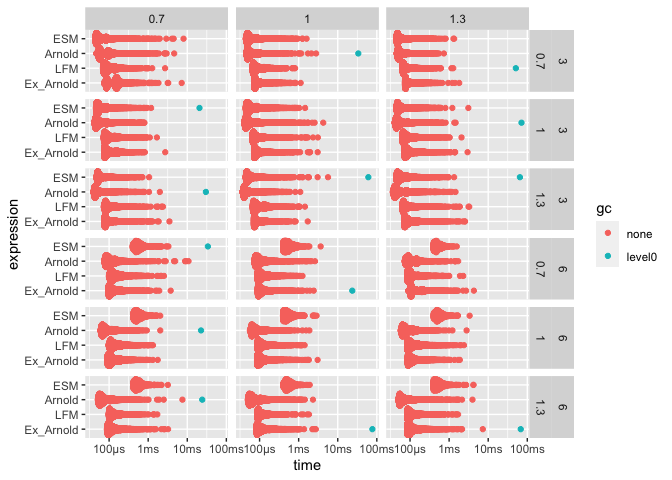

Comparison of 0.2.5 and 0.2.4
================

    tmpdir <- tempdir()
    suppressMessages(remotes::install_github(
      "hsloot/rmo@v0.2.4", lib = tmpdir, quiet = TRUE))

    library("tidyverse")

    ## ── Attaching packages ────────────────────────────────────────────────────────────────────────────────────────────────── tidyverse 1.3.0 ──

    ## ✓ ggplot2 3.3.2     ✓ purrr   0.3.4
    ## ✓ tibble  3.0.3     ✓ dplyr   1.0.2
    ## ✓ tidyr   1.1.2     ✓ stringr 1.4.0
    ## ✓ readr   1.3.1     ✓ forcats 0.5.0

    ## ── Conflicts ───────────────────────────────────────────────────────────────────────────────────────────────────── tidyverse_conflicts() ──
    ## x dplyr::filter() masks stats::filter()
    ## x dplyr::lag()    masks stats::lag()

    library("purrr")

    library("bench")
    library("ggplot2")

    source(system.file(
      "Rsource", "parameter_generator.R",
      package="rmo", mustWork=TRUE))

General notes
-------------

-   The assertions can take up a large part of the runtime, depending on
    the algorithm. Hence, we will directly call the C++ methods without
    performing parameter checks before.
-   We have to use the pre R 3.6.x sample RNG, since the new one is not
    yet implemented in Rcpp.

<!-- -->

    suppressWarnings(
      RNGkind(
        kind="Mersenne-Twister", 
        normal.kind = "Inversion", 
        sample.kind="Rounding"))

    n <- 1e2L

Global Shock Model / Cuadras-Augé Parameter
-------------------------------------------

The first test case is one with a global shock model or Cuadras-Augé
parametrisation.

Our expectation is that all algorithms get a significantly better
runtime, however, some special factors have to be taken into
consideration (the following points apply the the new, optimized
algortihms).

-   The ESM algorithm was optimized such that shocks with zero-intensity
    do not require any action. Therefore, in low dimensions, we expect
    not to much difference between the tailored Cuadras-Augé algorithm
    and the general purpose ESM algorithm.
-   This parametrisation can either be favorable or unfavorable for the
    \``Arnold models''.    If the ratio`alpha/beta\` is high, we can
    expect the algorithms to run longer than if it is low, since in the
    former case less shocks would be required (in expectation) until all
    components are dead. This effect should be more pronounced for the
    general Arnold model, since its initialisation costs make up a lower
    fraction of its runtime.
-   For the LFM, the specific parametrisations, should not really
    influence the runtime of the algorithm.
-   For a higher dimension, we expect that the general Arnold model and
    the ESM slow down considerable, due to the large dimension of the
    input vector.

<!-- -->

    library("rmo")

    d <-c(3L, 6L)
    alpha <- c(0.1, 0.4, 0.8)
    beta <- c(0.1, 0.4, 0.8)

    params <- tibble(expand.grid(
      "d" = d,
      "alpha" = alpha,
      "beta" = beta
    ))

    ex_intensity_list <- force(pmap(params, ~{
      ex_intensities_cuadras_auge(..1, alpha=..2, beta=..2)
    }))
    intensity_list <- force(pmap(params, ~{
      intensities_cuadras_auge(..1, alpha=..2, beta=..2)
    }))

    bp1 <- bench::press(
      "d" = d,
      "alpha" = alpha,
      "beta" = beta,
      {
        idx <- which(
          params$d == d &
            params$alpha == alpha &
            params$beta == beta)
        ex_intensities <- ex_intensity_list[[idx]]
        intensities <- intensity_list[[idx]]

        bench::mark(
          ESM = rmo:::Rcpp__rmo_esm(
            n, d, intensities=intensities),
          Arnold = rmo:::Rcpp__rmo_arnold(
            n, d, intensities=intensities),
          Ex_Arnold = rmo:::Rcpp__rmo_ex_arnold(
            n, d, ex_intensities=ex_intensities),
          LFM = rmo:::Rcpp__rmo_lfm_cpp(
            n, d, 0, alpha, beta, "rposval", list("value"=1)),
          Cuadras_Auge = rmo:::Rcpp__rmo_esm_cuadras_auge(
            n, d, alpha, beta),
          min_iterations = 100L,
          check=FALSE
        )
      }
    )

    ## Running with:
    ##        d alpha  beta

    ##  1     3   0.1   0.1

    ##  2     6   0.1   0.1

    ##  3     3   0.4   0.1

    ##  4     6   0.4   0.1

    ##  5     3   0.8   0.1

    ##  6     6   0.8   0.1

    ##  7     3   0.1   0.4

    ##  8     6   0.1   0.4

    ##  9     3   0.4   0.4

    ## 10     6   0.4   0.4

    ## 11     3   0.8   0.4

    ## 12     6   0.8   0.4

    ## 13     3   0.1   0.8

    ## 14     6   0.1   0.8

    ## 15     3   0.4   0.8

    ## 16     6   0.4   0.8

    ## 17     3   0.8   0.8

    ## 18     6   0.8   0.8

    bp1 %>%
      unnest(cols = c("time", "gc")) %>%
      mutate(expression = factor(
        expression,
        levels = c("Cuadras_Auge", "Ex_Arnold", "LFM", "Arnold", "ESM")
        )) %>%
      ggplot(aes(expression, time, colour = gc)) +
      ggbeeswarm::geom_quasirandom() +
      ggplot2::coord_flip() +
      facet_grid(d + alpha ~ beta)

<!-- -->

    detach("package:rmo", unload = TRUE)
    library(rmo, lib.loc = tmpdir)

    bp1_prev <- bench::press(
      "d" = d,
      "alpha" = alpha,
      "beta" = beta,
      {
        idx <- which(
          params$d == d &
            params$alpha == alpha &
            params$beta == beta)
        ex_intensities <- ex_intensity_list[[idx]]
        intensities <- intensity_list[[idx]]

        bench::mark(
          ESM = rmo:::Rcpp__rmo_esm(
            n, d, intensities=intensities),
          Arnold = rmo:::Rcpp__rmo_arnold(
            n, d, intensities=intensities),
          Ex_Arnold = rmo:::Rcpp__rmo_ex_arnold(
            n, d, ex_intensities=ex_intensities),
          LFM = rmo:::Rcpp__rmo_lfm_cpp(
            n, d, 0, alpha, beta, "rposval", list("value"=1)),
          Cuadras_Auge = rmo:::Rcpp__rmo_esm_cuadras_auge(
            n, d, alpha, beta),
          min_iterations = 100L,
          check=FALSE
        )
      }
    )

    ## Running with:
    ##        d alpha  beta

    ##  1     3   0.1   0.1

    ##  2     6   0.1   0.1

    ##  3     3   0.4   0.1

    ##  4     6   0.4   0.1

    ##  5     3   0.8   0.1

    ##  6     6   0.8   0.1

    ##  7     3   0.1   0.4

    ##  8     6   0.1   0.4

    ##  9     3   0.4   0.4

    ## 10     6   0.4   0.4

    ## 11     3   0.8   0.4

    ## 12     6   0.8   0.4

    ## 13     3   0.1   0.8

    ## 14     6   0.1   0.8

    ## 15     3   0.4   0.8

    ## 16     6   0.4   0.8

    ## 17     3   0.8   0.8

    ## 18     6   0.8   0.8

    bp1_prev %>%
      unnest(cols = c("time", "gc")) %>%
      mutate(expression = factor(
        expression,
        levels = c("Cuadras_Auge", "Ex_Arnold", "LFM", "Arnold", "ESM")
      )) %>%
      ggplot(aes(expression, time, colour = gc)) +
      ggbeeswarm::geom_quasirandom() +
      ggplot2::coord_flip() +
      facet_grid(d + alpha ~ beta)

<!-- -->

    detach("package:rmo", unload = TRUE)

Poisson LFM parametrisation
---------------------------

This type of parametrisation does not allow a particular advantage to
the ESM because of its internal optimizations. Furthermore, some
parametrisations, e.g. `lambda = 1` and `eta = 0.7`, can be particularly
unfavourable to the Arnold model as it places lots of weight on shocks
with medium cardinality.

    library(rmo)

    lambda <- c(0.7, 1, 1.3)
    eta <- c(0.7, 1, 1.3)

    params <- tibble(expand.grid(
      "d" = d,
      "lambda" = lambda,
      "eta" = eta
    ))

    ex_intensity_list <- force(pmap(params, ~{
      ex_intensities_poisson(..1, lambda=..2, eta=..2)
    }))
    intensity_list <- force(pmap(params, ~{
      intensities_poisson(..1, lambda=..2, eta=..2)
    }))

    bp2 <- bench::press(
      "d" = d,
      "lambda" = lambda,
      "eta" = eta,
      {
        idx <- which(
          params$d == d &
            params$lambda == lambda &
            params$eta == eta)
        ex_intensities <- ex_intensity_list[[idx]]
        intensities <- intensity_list[[idx]]

        bench::mark(
          ESM = rmo:::Rcpp__rmo_esm(
            n, d, intensities=intensities),
          Arnold = rmo:::Rcpp__rmo_arnold(
            n, d, intensities=intensities),
          Ex_Arnold = rmo:::Rcpp__rmo_ex_arnold(
            n, d, ex_intensities=ex_intensities),
          LFM = rmo:::Rcpp__rmo_lfm_cpp(
            n, d, lambda, 0, 0, "rposval", list("value"=eta)),
          min_iterations = 100L,
          check=FALSE
        )
      }
    )

    ## Running with:
    ##        d lambda   eta

    ##  1     3    0.7   0.7

    ##  2     6    0.7   0.7

    ##  3     3    1     0.7

    ##  4     6    1     0.7

    ##  5     3    1.3   0.7

    ##  6     6    1.3   0.7

    ##  7     3    0.7   1

    ##  8     6    0.7   1

    ##  9     3    1     1

    ## 10     6    1     1

    ## 11     3    1.3   1

    ## 12     6    1.3   1

    ## 13     3    0.7   1.3

    ## 14     6    0.7   1.3

    ## 15     3    1     1.3

    ## 16     6    1     1.3

    ## 17     3    1.3   1.3

    ## 18     6    1.3   1.3

    bp2 %>%
      unnest(cols = c("time", "gc")) %>%
      mutate(expression = factor(
        expression,
        levels = c("Ex_Arnold", "LFM", "Arnold", "ESM")
        )) %>%
      ggplot(aes(expression, time, colour = gc)) +
      ggbeeswarm::geom_quasirandom() +
      ggplot2::coord_flip() +
      facet_grid(d + lambda ~ eta) 

<!-- -->

    detach("package:rmo", unload = TRUE)
    library(rmo, lib.loc = tmpdir)

    bp2_prev <- bench::press(
      "d" = d,
      "lambda" = lambda,
      "eta" = eta,
      {
        idx <- which(
          params$d == d &
            params$lambda == lambda &
            params$eta == eta)
        ex_intensities <- ex_intensity_list[[idx]]
        intensities <- intensity_list[[idx]]

        bench::mark(
          ESM = rmo:::Rcpp__rmo_esm(
            n, d, intensities=intensities),
          Arnold = rmo:::Rcpp__rmo_arnold(
            n, d, intensities=intensities),
          Ex_Arnold = rmo:::Rcpp__rmo_ex_arnold(
            n, d, ex_intensities=ex_intensities),
          LFM = rmo:::Rcpp__rmo_lfm_cpp(
            n, d, lambda, 0, 0, "rposval", list("value"=eta)),
          min_iterations = 100L,
          check=FALSE
        )
      }
    )

    ## Running with:
    ##        d lambda   eta

    ##  1     3    0.7   0.7

    ##  2     6    0.7   0.7

    ##  3     3    1     0.7

    ##  4     6    1     0.7

    ##  5     3    1.3   0.7

    ##  6     6    1.3   0.7

    ##  7     3    0.7   1

    ##  8     6    0.7   1

    ##  9     3    1     1

    ## 10     6    1     1

    ## 11     3    1.3   1

    ## 12     6    1.3   1

    ## 13     3    0.7   1.3

    ## 14     6    0.7   1.3

    ## 15     3    1     1.3

    ## 16     6    1     1.3

    ## 17     3    1.3   1.3

    ## 18     6    1.3   1.3

    bp2_prev %>%
      unnest(cols = c("time", "gc")) %>%
      mutate(expression = factor(
        expression,
        levels = c("Ex_Arnold", "LFM", "Arnold", "ESM")
        )) %>%
      ggplot(aes(expression, time, colour = gc)) +
      ggbeeswarm::geom_quasirandom() +
      ggplot2::coord_flip() +
      facet_grid(d + lambda ~ eta) 

<!-- -->

    detach("package:rmo", unload = TRUE)
