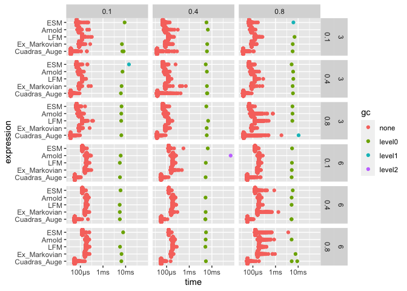
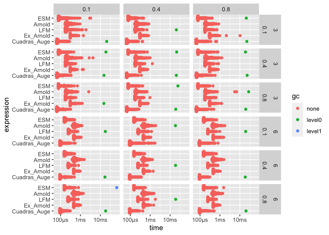
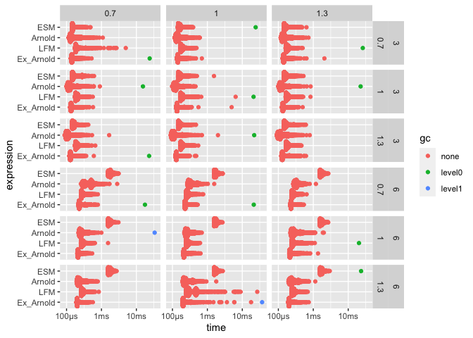
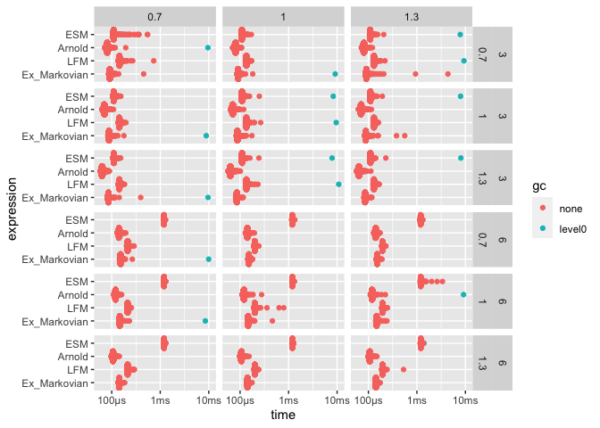
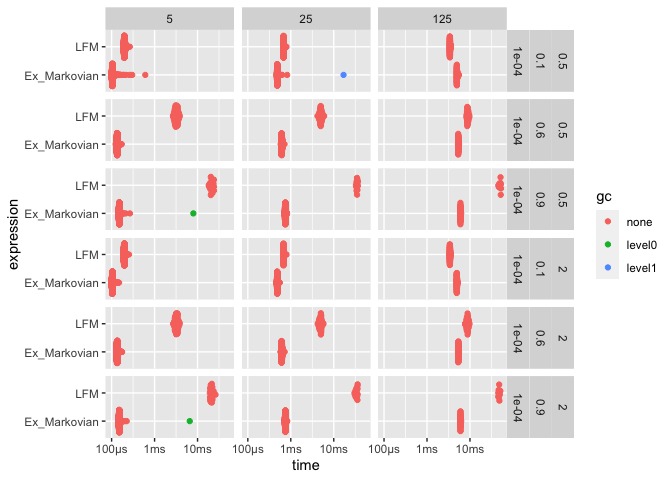
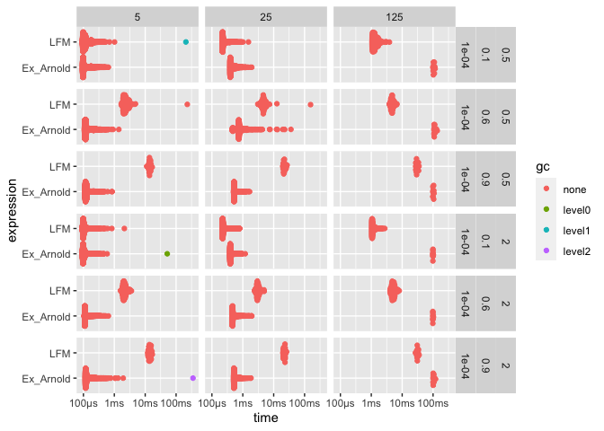
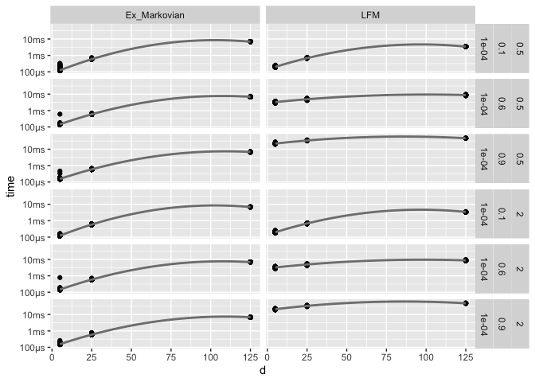

Comparison of v0.2.6 and v0.2.5
================

## General notes

-   The assertions can take up a large part of the runtime, depending on
    the algorithm. Hence, we will directly call the C++ methods without
    performing parameter checks before.

``` r
n <- 1e2L
min_iterations <- 10L
```

## Global Shock Model / Cuadras-Augé Parameter

The first test case is one with a global shock model or Cuadras-Augé
parametrisation.

Our expectation is that all algorithms get a significantly better
runtime, however, some special factors have to be taken into
consideration (the following points apply the the new, optimized
algortihms).

-   The ESM algorithm was optimized such that shocks with zero-intensity
    do not require any action. Therefore, in low dimensions, we expect
    not to much difference between the tailored Cuadras-Augé algorithm
    and the general purpose ESM algorithm.
-   This parametrisation can either be favorable or unfavorable for the
    \``Arnold models''.    If the ratio`alpha/beta\` is high, we can
    expect the algorithms to run longer than if it is low, since in the
    former case less shocks would be required (in expectation) until all
    components are dead. This effect should be more pronounced for the
    general Arnold model, since its initialisation costs make up a lower
    fraction of its runtime.
-   For the LFM, the specific parametrisations, should not really
    influence the runtime of the algorithm.
-   For a higher dimension, we expect that the general Arnold model and
    the ESM slow down considerable, due to the large dimension of the
    input vector.

``` r
library("rmo")

d <-c(3L, 6L)
alpha <- c(0.1, 0.4, 0.8)
beta <- c(0.1, 0.4, 0.8)

dparams <- tibble(expand.grid(
  "d" = d,
  "alpha" = alpha,
  "beta" = beta
))

ex_intensity_list <- force(pmap(dparams, ~{
  ex_intensities_cuadras_auge(..1, alpha=..2, beta=..2)
}))
intensity_list <- force(pmap(dparams, ~{
  intensities_cuadras_auge(..1, alpha=..2, beta=..2)
}))
```

``` r
bp1 <- bench::press(
  "d" = d,
  "alpha" = alpha,
  "beta" = beta,
  {
    idx <- which(
      dparams$d == d &
        dparams$alpha == alpha &
        dparams$beta == beta)
    ex_intensities <- ex_intensity_list[[idx]]
    intensities <- intensity_list[[idx]]

    bench::mark(
      ESM = rmo:::Rcpp__rmo_esm(
        n, d, intensities=intensities),
      Arnold = rmo:::Rcpp__rmo_arnold(
        n, d, intensities=intensities),
      Ex_Arnold = rmo:::Rcpp__rmo_ex_arnold(
        n, d, ex_intensities=ex_intensities),
      LFM = rmo:::Rcpp__rmo_lfm_cpp(
        n, d, 0, alpha, beta, "rposval", list("value"=1)),
      Cuadras_Auge = rmo:::Rcpp__rmo_esm_cuadras_auge(
        n, d, alpha, beta),
      min_iterations = min_iterations,
      check=FALSE
    )
  }
)

bp1 %>%
  unnest(cols = c("time", "gc")) %>%
  mutate(expression = factor(
    expression,
    levels = c("Cuadras_Auge", "Ex_Arnold", "LFM", "Arnold", "ESM")
    )) %>%
  ggplot(aes(expression, time, colour = gc)) +
  ggbeeswarm::geom_quasirandom() +
  ggplot2::coord_flip() +
  facet_grid(d + alpha ~ beta)
```

<!-- -->

``` r
detach("package:rmo", unload = TRUE)
library(rmo, lib.loc = tmpdir)

bp1_prev <- bench::press(
  "d" = d,
  "alpha" = alpha,
  "beta" = beta,
  {
    idx <- which(
      dparams$d == d &
        dparams$alpha == alpha &
        dparams$beta == beta)
    ex_intensities <- ex_intensity_list[[idx]]
    intensities <- intensity_list[[idx]]

    bench::mark(
      ESM = rmo:::Rcpp__rmo_esm(
        n, d, intensities=intensities),
      Arnold = rmo:::Rcpp__rmo_arnold(
        n, d, intensities=intensities),
      Ex_Arnold = rmo:::Rcpp__rmo_ex_arnold(
        n, d, ex_intensities=ex_intensities),
      LFM = rmo:::Rcpp__rmo_lfm_cpp(
        n, d, 0, alpha, beta, "rposval", list("value"=1)),
      Cuadras_Auge = rmo:::Rcpp__rmo_esm_cuadras_auge(
        n, d, alpha, beta),
      min_iterations = min_iterations,
      check=FALSE
    )
  }
)

bp1_prev %>%
  unnest(cols = c("time", "gc")) %>%
  mutate(expression = factor(
    expression,
    levels = c("Cuadras_Auge", "Ex_Arnold", "LFM", "Arnold", "ESM")
  )) %>%
  ggplot(aes(expression, time, colour = gc)) +
  ggbeeswarm::geom_quasirandom() +
  ggplot2::coord_flip() +
  facet_grid(d + alpha ~ beta)
```

<!-- -->

``` r
detach("package:rmo", unload = TRUE)
```

## Poisson LFM parametrisation

This type of parametrisation does not allow a particular advantage to
the ESM because of its internal optimizations. Furthermore, some
parametrisations, e.g. `lambda = 1` and `eta = 0.7`, can be particularly
unfavourable to the Arnold model as it places lots of weight on shocks
with medium cardinality.

``` r
library(rmo)

lambda <- c(0.7, 1, 1.3)
eta <- c(0.7, 1, 1.3)

dparams <- tibble(expand.grid(
  "d" = d,
  "lambda" = lambda,
  "eta" = eta
))

ex_intensity_list <- force(pmap(dparams, ~{
  ex_intensities_poisson(..1, lambda=..2, eta=..2)
}))
intensity_list <- force(pmap(dparams, ~{
  intensities_poisson(..1, lambda=..2, eta=..2)
}))
```

``` r
bp2 <- bench::press(
  "d" = d,
  "lambda" = lambda,
  "eta" = eta,
  {
    idx <- which(
      dparams$d == d &
        dparams$lambda == lambda &
        dparams$eta == eta)
    ex_intensities <- ex_intensity_list[[idx]]
    intensities <- intensity_list[[idx]]

    bench::mark(
      ESM = rmo:::Rcpp__rmo_esm(
        n, d, intensities=intensities),
      Arnold = rmo:::Rcpp__rmo_arnold(
        n, d, intensities=intensities),
      Ex_Arnold = rmo:::Rcpp__rmo_ex_arnold(
        n, d, ex_intensities=ex_intensities),
      LFM = rmo:::Rcpp__rmo_lfm_cpp(
        n, d, lambda, 0, 0, "rposval", list("value"=eta)),
      min_iterations = min_iterations,
      check=FALSE
    )
  }
)

bp2 %>%
  unnest(cols = c("time", "gc")) %>%
  mutate(expression = factor(
    expression,
    levels = c("Ex_Arnold", "LFM", "Arnold", "ESM")
    )) %>%
  ggplot(aes(expression, time, colour = gc)) +
  ggbeeswarm::geom_quasirandom() +
  ggplot2::coord_flip() +
  facet_grid(d + lambda ~ eta)
```

<!-- -->

``` r
detach("package:rmo", unload = TRUE)
library(rmo, lib.loc = tmpdir)

bp2_prev <- bench::press(
  "d" = d,
  "lambda" = lambda,
  "eta" = eta,
  {
    idx <- which(
      dparams$d == d &
        dparams$lambda == lambda &
        dparams$eta == eta)
    ex_intensities <- ex_intensity_list[[idx]]
    intensities <- intensity_list[[idx]]

    bench::mark(
      ESM = rmo:::Rcpp__rmo_esm(
        n, d, intensities=intensities),
      Arnold = rmo:::Rcpp__rmo_arnold(
        n, d, intensities=intensities),
      Ex_Arnold = rmo:::Rcpp__rmo_ex_arnold(
        n, d, ex_intensities=ex_intensities),
      LFM = rmo:::Rcpp__rmo_lfm_cpp(
        n, d, lambda, 0, 0, "rposval", list("value"=eta)),
      min_iterations = min_iterations,
      check=FALSE
    )
  }
)

bp2_prev %>%
  unnest(cols = c("time", "gc")) %>%
  mutate(expression = factor(
    expression,
    levels = c("Ex_Arnold", "LFM", "Arnold", "ESM")
    )) %>%
  ggplot(aes(expression, time, colour = gc)) +
  ggbeeswarm::geom_quasirandom() +
  ggplot2::coord_flip() +
  facet_grid(d + lambda ~ eta)
```

<!-- -->

``` r
detach("package:rmo", unload = TRUE)
```

## Pareto LFM parametrisation

We use this parametrisation to compare the LFM and the exchangeable
Arnold model in higher dimensions. This parametrisation is more
unfavorable for the LFM, since Pareto jumps are computationally more
expensive than fixed size jumps or exponential jumps.

``` r
library(rmo)

# n <- 1e3L

d <- c(5L, 25L, 125L)
rate <- c(0.5, 2)
alpha <- c(0.1, 0.6, 0.9)
x0 <- c(1e-4)

dparams <- tibble(expand.grid(
  "d" = d,
  "alpha" = alpha,
  "x0" = x0,
  "rate" = rate
))

ex_intensity_list <- force(pmap(dparams, ~{
  ex_intensities_pareto(..1, alpha=..2, x0=..3) / ..4
}))
```

``` r
bp3 <- bench::press(
  "d" = d,
  "alpha" = alpha,
  "x0" = x0,
  "rate" = rate,
  {
    idx <- which(
      dparams$d == d &
        dparams$alpha == alpha &
        dparams$x0 == x0 & 
        dparams$rate == rate)
    ex_intensities <- ex_intensity_list[[idx]]

    bench::mark(
      Ex_Arnold = rmo:::Rcpp__rmo_ex_arnold(
        n, d, ex_intensities=ex_intensities),
      LFM = rmo:::Rcpp__rmo_lfm_cpp(
        n, d, rate, 0, 0, "rpareto", list("alpha"=alpha, "x0"=x0)),
      min_iterations = min_iterations,
      check=FALSE
    )
  }
)

bp3 %>%
  unnest(cols = c("time", "gc")) %>%
  mutate(expression = factor(
    expression,
    levels = c("Ex_Arnold", "LFM")
    )) %>%
  ggplot(aes(expression, time, colour = gc)) +
  ggbeeswarm::geom_quasirandom() +
  ggplot2::coord_flip() +
  facet_grid(rate + alpha + x0 ~ d)
```

<!-- -->

``` r
bp3 %>%
  unnest(cols = c("time", "gc")) %>%
  mutate(expression = factor(
    expression,
    levels = c("Ex_Arnold", "LFM")
    )) %>%
  filter(gc == "none") %>%
  ggplot(aes(x=d, y=time)) +
  geom_point() +
  geom_smooth(method = "lm", se = FALSE, colour = "grey50", formula = y ~ x + I(x^2)) +
  theme(legend.position = "bottom") +
  facet_grid(rate + alpha + x0 ~ expression)
```

<!-- -->

``` r
detach("package:rmo", unload = TRUE)
library(rmo, lib.loc = tmpdir)

bp3_prev <- bench::press(
  "d" = d,
  "alpha" = alpha,
  "x0" = x0,
  "rate" = rate,
  {
    idx <- which(
      dparams$d == d &
        dparams$alpha == alpha &
        dparams$x0 == x0 & 
        dparams$rate == rate)
    ex_intensities <- ex_intensity_list[[idx]]

    bench::mark(
      Ex_Arnold = rmo:::Rcpp__rmo_ex_arnold(
        n, d, ex_intensities=ex_intensities),
      LFM = rmo:::Rcpp__rmo_lfm_cpp(
        n, d, rate, 0, 0, "rpareto", list("alpha"=alpha, "x0"=x0)),
      min_iterations = min_iterations,
      check=FALSE
    )
  }
)

bp3_prev %>%
  unnest(cols = c("time", "gc")) %>%
  mutate(expression = factor(
    expression,
    levels = c("Ex_Arnold", "LFM")
    )) %>%
  ggplot(aes(expression, time, colour = gc)) +
  ggbeeswarm::geom_quasirandom() +
  ggplot2::coord_flip() +
  facet_grid(rate + alpha + x0 ~ d)
```

<!-- -->

``` r
bp3_prev %>%
  unnest(cols = c("time", "gc")) %>%
  mutate(expression = factor(
    expression,
    levels = c("Ex_Arnold", "LFM")
    )) %>%
  filter(gc == "none") %>%
  ggplot(aes(x=d, y=time)) +
  geom_point() +
  geom_smooth(method = "lm", se = FALSE, colour = "grey50", formula = y ~ x + I(x^2)) +
  theme(legend.position = "bottom") +
  facet_grid(rate + alpha + x0 ~ expression)
```

<!-- -->

``` r
detach("package:rmo", unload = TRUE)
```
